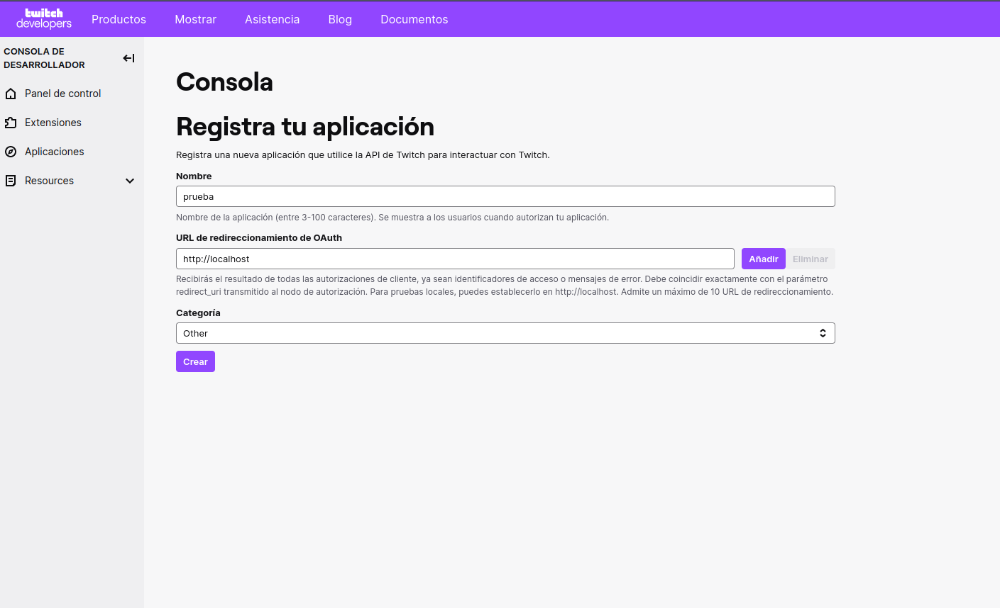
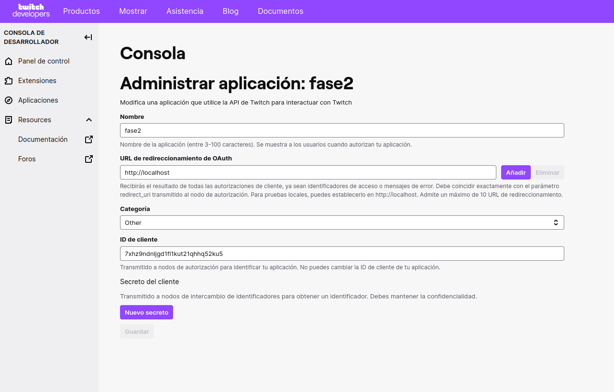

# Proyecto de Sistemas de Bases de Datos 2 - Universidad de San Carlos de Guatemala 2023 Segundo Semestre

## Descripción
Este proyecto se centra en cargar información relacionada con el negocio de los videojuegos desde el sitio web [https://www.igdb.com/](https://www.igdb.com/). Los datos se almacenan en una base de datos relacional y en una base de datos NoSQL (MongoDB). Además, se implementan consultas y procedimientos almacenados para acceder y mostrar información específica de los juegos.

## Fases del Proyecto

### Fase 1

#### a) Modelo de Datos
Se presenta el modelo de datos utilizado para la carga de los datos, que incluye tablas, relaciones y atributos. Este modelo se ha definido conforme a las reuniones en clase y a los requisitos del proyecto.

#### b) Extracción y Carga de Datos
Para extraer los datos del sitio [https://www.igdb.com/](https://www.igdb.com/), utilizamos las APIs disponibles y los cargamos en una base de datos relacional de elección. A continuación, se proporciona una guía de los pasos necesarios para lograr esto:

##### b.1) Paso 1: Regístrese en Twitch Developers y Registre una Aplicación

Primero, debe registrarse en el sitio de Twitch Developers y crear una nueva aplicación para obtener credenciales de API. Aquí hay una captura de pantalla de cómo registrar una aplicación:



Una vez que haya completado este paso, obtendrá un ID de Cliente y una Secret Key, como se mencionó en la parte anterior.

#### b.2) Paso 2: Generar una Secret Key

Necesitará la Secret Key para autenticar su solicitud a la API de Twitch. Aquí hay una captura de pantalla de cómo generar la Secret Key:



Por ejemplo:

- ID del Cliente: 4a39rzmpjiy0m9dsne174j7rs2v0li
- ID de la Secret Key: 57481gm1vpobu1sknj3s9opb2soult

#### b.3) Autenticación y Acceso a la API de Twitch

Después de obtener sus credenciales de API de Twitch, puede utilizarlas para autenticar y acceder a la API. A continuación, se muestra un ejemplo de cómo hacer una solicitud POST con curl para obtener un token de acceso:

```bash
curl -X POST "https://id.twitch.tv/oauth2/token" \
-d "client_id=4a39rzmpjiy0m9dsne174j7rs2v0li" \
-d "client_secret=57481gm1vpobu1sknj3s9opb2soult" \
-d "grant_type=client_credentials"
```

Este comando curl realiza una solicitud POST a la URL "https://id.twitch.tv/oauth2/token" con los datos requeridos en el cuerpo de la solicitud, lo que resulta en un token de acceso que se utiliza para autenticar sus solicitudes a la API de Twitch.

La respuesta tendrá un formato JSON, y debería verse algo así:

```json
{"access_token":"gu2tf2uczypq8lwaar86kkmimf3o1jsuadad","expires_in":5070743,"token_type":"bearer"}
```

Luego, puede utilizar el token de acceso y las credenciales de cliente para realizar solicitudes a los puntos finales de la API de Twitch, como se muestra en la parte final de tu documento.

Espero que esta información sea útil para tu proyecto. Si necesitas más detalles o ayuda adicional, no dudes en preguntar.

¡Por supuesto! Aquí está la información adicional que deseas agregar al documento:

#### b.4) Conexión y Solicitud a los Endpoints

Una vez que haya obtenido el token de acceso y las credenciales de cliente de Twitch, puede utilizarlos para conectarse y realizar solicitudes a los endpoints de la API. A continuación, se muestra un ejemplo de cómo construir una solicitud y realizarla:

```javascript
const headers = {
  'Client-ID': `${apiKey}`,
  'Authorization': `Bearer ${accessToken}`,
  'Accept': 'application/json',
};

// Crea la cláusula WHERE utilizando los límites
const whereClause = `where id >= ${lowerLimit}`;

// Crea el cuerpo de la solicitud incluyendo la cláusula WHERE
const body = `${endpoint.fieldsName} ${whereClause}; limit 500; sort id asc;`;
const response = await fetch(endpoint.url, {
  method: 'POST',
  headers: headers,
  body: body
});
```

En este ejemplo, hemos definido un objeto `headers` que contiene las credenciales de cliente y el token de acceso necesarios para autenticar la solicitud. Luego, hemos construido una cláusula `WHERE` basada en los límites que deseamos aplicar a la consulta.

El cuerpo de la solicitud se compone de la información necesaria para la consulta, incluida la selección de campos (`endpoint.fieldsName`) y la cláusula `WHERE`. La solicitud se realiza utilizando el método `POST` y se incluyen los encabezados y el cuerpo en la solicitud.

También se proporciona un ejemplo de cómo definir endpoints para diferentes tipos de datos, como juegos (Game), que incluye la URL del endpoint, el mapeo de campos y el nombre de la tabla correspondiente en la base de datos.

```javascript
const endpoints = {
  game: {
    url: 'https://api.igdb.com/v4/games',
    fieldsMapping: {
      'idGame': 'id',
      'name': 'name',
      // ... Otros campos mapeados
    },
    fieldsName: "fields id, name, summary, storyline, rating, rating_count, ...", // Campos que deseas recuperar
    tableName: "Game" // Nombre de la tabla en la base de datos relacional
  },
  // Otros endpoints para diferentes tipos de datos
};
```

Con esta estructura, puedes definir fácilmente endpoints para diferentes tipos de datos y realizar solicitudes a la API de acuerdo con tus necesidades.

Espero que esta información adicional sea de utilidad para tu proyecto. Si tienes más preguntas o necesitas más detalles, no dudes en preguntar.

#### c) Stored Procedure
Se ha implementado un stored procedure que recibe el nombre del juego o su ID como parámetro y muestra información relacionada con el mismo, siguiendo el formato mínimo requerido.

### Fase 2

#### SQL
a) Se realiza la restauración de un backup de la base de datos relacional creada en la Fase 1, utilizando scripts.

b) Se efectúa la truncación de la bitácora, se obtiene el collation de las tablas y columnas, y se verifica la fragmentación de los índices. Todo esto se realiza mediante scripts SQL.

#### MongoDB
c) Se carga toda la información recopilada en la Fase 1 en una base de datos NoSQL (MongoDB). Se garantiza la capacidad de navegar y extraer cualquier dato necesario.

d) Se documenta el proceso de carga en MongoDB, utilizando las herramientas disponibles.

e) Se presenta el diseño de la base de datos NoSQL, explicando la estructura de los documentos y colecciones utilizados.

f) Las consultas definidas en la Fase 1 se replican en MongoDB, utilizando métodos o funciones en lugar de stored procedures. Se proporciona el código utilizado.

## Instrucciones de Uso
Se proporcionan instrucciones claras sobre cómo utilizar y ejecutar las consultas, stored procedures y otros elementos del proyecto.

## Calificación
Se detalla la fecha de entrega y calificación de cada fase del proyecto.

## README.md
Un archivo README.md se proporciona en la raíz del proyecto para resumir la información clave y facilitar la comprensión del proyecto.

Asegúrate de que la documentación sea clara, concisa y esté bien organizada. Proporciona ejemplos y ejecute las consultas y procedimientos para demostrar su funcionamiento.

Este es solo un esbozo y puedes adaptarlo según tus necesidades específicas y los detalles de tu proyecto. Asegúrate de cumplir con todos los requisitos del proyecto y de que la documentación sea completa y fácil de entender.